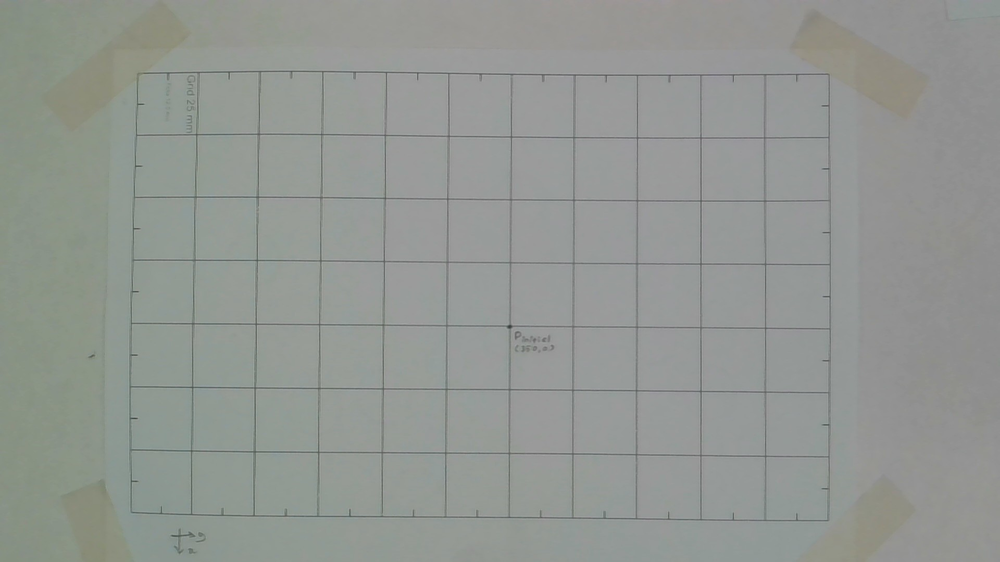
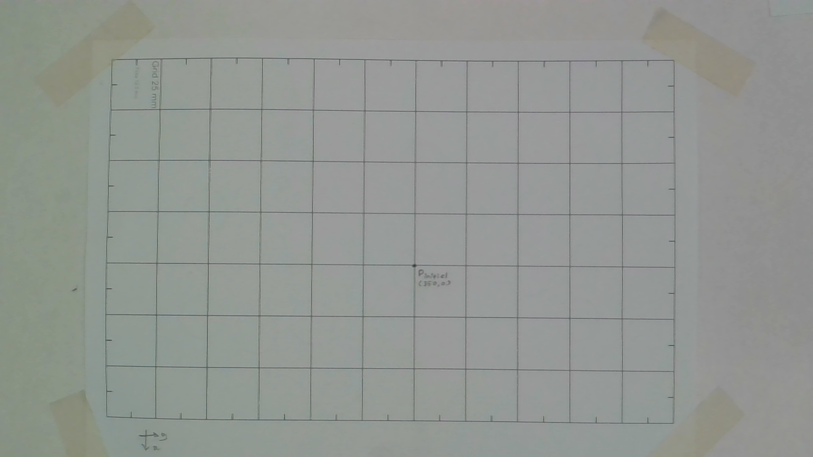

# Vision-Guided Pick-and-Place System Using the Dobot MG400

**Detailed Academic Explanation**

---

## 1. Introduction

This laboratory project investigates the integration of a **machine vision system** with a **desktop robotic manipulator** to perform automated pick-and-place operations. The robotic platform used in this work is the **:contentReference[oaicite:0]{index=0}**, a compact four-axis industrial robot designed for small-scale automation tasks.

The primary objective of the project is to design and implement a complete perception-to-action pipeline that enables the robot to:

- Perceive objects in its workspace using a camera,
- Identify objects based on visual features,
- Compute their positions in robot coordinates,
- Execute reliable pick-and-place motions.

This work emphasizes **clarity, modularity, and educational value**, making it suitable for laboratory instruction and introductory research in robotics and machine vision.

---

## 2. System Architecture

The overall system architecture is divided into four main functional blocks:

1. Image Acquisition
2. Vision-Based Object Detection
3. Coordinate Mapping and Calibration
4. Robotic Motion Control

These components operate sequentially, forming a linear processing pipeline:

This separation of concerns simplifies debugging and allows each module to be improved independently.

---

## 3. Image Acquisition

### 3.1 Description

Image acquisition is performed using a fixed external camera positioned above the robot workspace. A single image frame is captured on demand using OpenCV and passed to the vision module for processing.

### 3.2 Design Rationale

A single-frame capture approach was selected instead of continuous video streaming for the following reasons:

- Reduced computational complexity,
- Easier synchronization with robot actions,
- Improved reproducibility during testing.

### 3.3 Example Image

The figure below shows an example of a raw image captured from the camera before any processing.

_Figure 1: Raw image of the robot workspace captured by the camera._

---

## 4. Vision-Based Object Detection

### 4.1 Detection Methodology

Object detection is implemented using **classical computer vision techniques** rather than deep learning. The following steps are applied:

1. Conversion of the image from BGR to HSV color space,
2. Color thresholding to isolate objects of interest,
3. Contour extraction from the binary mask,
4. Shape classification using geometric properties.

Objects are classified primarily as **circles** or **squares** based on contour circularity.

### 4.2 Justification of Design Choices

Classical vision was chosen because:

- It requires no training data,
- It is computationally efficient,
- It is transparent and easy to interpret,
- It performs reliably in controlled laboratory environments.

### 4.3 Detection Output Example

After processing, detected objects are annotated with contours and center points, as shown below.

_Figure 2: Detected objects with annotated contours and centroids._

---

## 5. Coordinate Mapping and Calibration

### 5.1 Purpose of Calibration

The camera detects objects in **pixel coordinates**, whereas the robot operates in **real-world Cartesian coordinates**. Calibration is required to establish a mathematical relationship between these two coordinate systems.

### 5.2 Homography-Based Mapping

A planar **homography transformation** is used to map image coordinates to robot coordinates:

The homography matrix is computed during calibration and stored in a configuration file.

### 5.3 Importance and Challenges

Calibration accuracy is critical. Even small errors in calibration can lead to:

- Misaligned picks,
- Failed grasps,
- Increased mechanical stress on the robot.

Calibration was found to be the most sensitive and time-consuming part of the project.

### 5.4 Calibration Visualization

An example of calibration reference points used during the setup is shown below.

_Figure 3: Calibration points used to compute the homography matrix._

---

## 6. Robotic Motion Control

### 6.1 Control Strategy

Robot control is implemented via TCP/IP communication with the robot controller. A simple and deterministic motion strategy is employed to ensure safety and repeatability.

### 6.2 Pick-and-Place Sequence

The robot executes the following sequence for each detected object:

1. Move to a predefined safe height,
2. Move above the target object,
3. Descend to the pick height,
4. Close the gripper,
5. Lift the object,
6. Move to the drop location,
7. Release the object.

This approach avoids unnecessary complexity and reduces the likelihood of collisions.

### 6.3 Motion Example

The sequence of robot motion during pick-and-place is illustrated below.

_Figure 4: Dobot MG400 executing a pick-and-place operation._

---

## 7. User Interfaces

### 7.1 Graphical User Interface

A graphical user interface developed using Streamlit allows users to:

- Capture or upload images,
- Visualize detection results,
- Connect to the robot,
- Execute pick-and-place commands interactively.

This interface is particularly useful for demonstrations and rapid testing.

### 7.2 Command-Line Interface

A command-line interface is also provided for scripted operation, enabling batch processing and easier integration into automated workflows.

---

## 8. Performance Evaluation and Discussion

### 8.1 Ease of Implementation

- Vision module: relatively easy to implement and debug
- Robot control: straightforward once communication was established
- Calibration: challenging and required multiple iterations

### 8.2 Development Time

The complete system was implemented over approximately **2–3 days**, including testing, calibration, and debugging.

### 8.3 Execution Speed

- Object detection: < 1 second per image
- Pick-and-place cycle: a few seconds per object

This performance is adequate for laboratory demonstrations and small-scale automation tasks.

### 8.4 Limitations

- Sensitivity to lighting variations
- Limited object variety
- No collision avoidance or grasp verification
- No automatic recalibration

---

## 9. Potential Improvements

Several enhancements could significantly improve the system:

- Integration of deep learning–based object detection,
- Automatic or assisted calibration procedures,
- Collision detection and avoidance,
- Feedback sensors for grasp confirmation,
- Improved robustness to lighting changes.

---

## 10. Conclusion

This laboratory project successfully demonstrates a complete **vision-guided robotic pick-and-place system**. While intentionally simple, it provides valuable hands-on experience in combining machine vision, calibration, and robotic motion control.

The system serves as a strong educational foundation and can be extended toward more advanced industrial or research-level automation solutions.

---
